# NFO U-Net
This repository provides an implementation of a spatio-temporal U-Net for heatmap based person detection under
fragmented occlusion. Proof of concept is done on synthetic data showing that the network is able to utilize both 
spatial and temporal features and can therefore extract spatio-temporal features. All findings have been published 
within the paper [Person localization under fragmented occlusion](). 

## Setup
Initialize and activate virtual environment
```bash
python3 -m venv .venv
.venv/bin/activate
```
Install requirements by executing:
```bash
pip install -r requirements.txt
```
Additionally get the latest version of pytorch for your system [here](https://pytorch.org/). The version used in this
project is pytorch 1.8.1.

## Generate data
Training and test data can be generated for the following three use cases:

### Moving noise
The *gen_data/gen_noise_data/* folder contains code for generating sequences of noisy background behind a moving object.
The object is assigned with a statistically identical texture as the background, therefore making it indistinguishable
from the background. Object localization should be realized by utilization of temporal data, i.e. detecting movement 
over time.\
In order to generate data samples, adapt the *gen_data/gen_noise_data/Config.py* file and run the 
*gen_data/gen_noise_data/main.py* script. This will generate data samples and the corresponding ground truth heatmaps as
listed below in the specified output directory. The images 1-3 mark the object in red for visualization purposes,
while the generated files look like image 4, i.e. not marked in red. The ground truth is visualized in image 5.

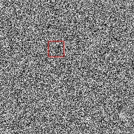
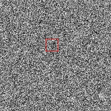
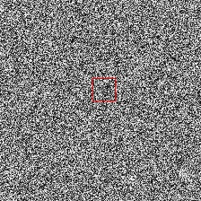
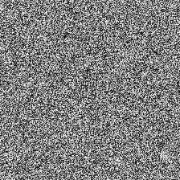
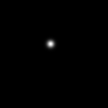

### Moving MNIST under occlusion
The *gen_data/gen_mnist_data/* folder contains scripts for generating sequences of moving digits over time. The key is 
to divide the digits 1-9 into two classes, i.e. one class should be highlighted on the output heatmap, whereas the other
should be ignored. Difficulty is added by overlaying the sequences with synthetic fragmented occlusion. This should
force the network to utilize spatio-temporal information, instead of just spatial appearance. \
For generation, first download the files *train-images-idx3-ubyte.gz* and *train-labels-idx1-ubyte.gz* from the MNIST 
dataset from [here](http://yann.lecun.com/exdb/mnist/). \
After that, adapt the *gen_data/gen_mnist_data/Config.py* file and run the *gen/data/gen_mnist_data/main.py* script, 
which will generate the dataset in the specified output directory. Generated files will look like the examples below:
Sequence samples (images 1-3), occluded sample (image 4) and ground truth heatmap (image 5) with only digit 3 detected, 
as digit 9 should be ignored.

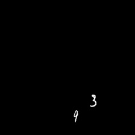
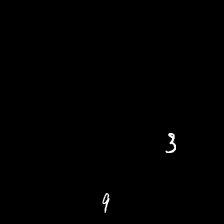
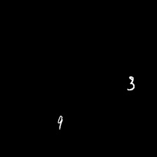
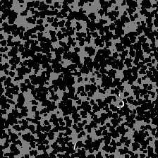


### KTH
The [KTH dataset](https://www.csc.kth.se/cvap/actions/) is a dataset for human action recognition. For the purpose of 
this work, the categories of *walking*, *jogging* and *running* have been annotated in the form of bounding boxes for 
person detection. The labels can be publicly accessed under this [link](https://drive.google.com/file/d/1RUm74rwEUHvW1bvAMHdgJ34MQr4AsunR/view?usp=sharing).
The corresponding videos are available [here](https://www.csc.kth.se/cvap/actions/). Adapt the 
*gen_data/gen_kth_data/kth_config.py* and run the *gen_data/gen_kth_data/main.py* script to generate the KTH image
sequences with corresponding heatmaps.

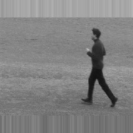
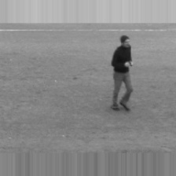
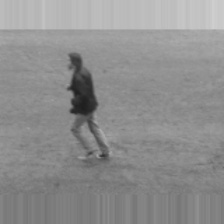

An already generated version of the data with resolution 224x224 can be accessed
[here](https://drive.google.com/file/d/1srEMclpnL8nQYVutoWVX7Hp6kOzY2IBm/view?usp=sharing).

## Training
Training can be done on either of the above generated datasets. Provide the necessary information for the training
process by defining a config object in *config/train_config.py*, which overrides the default values.
Training can be started by executing:
```bash
python3 -m train_main.py --config <config_name>
```

## Testing
Provide the necessary information for the testing process by defining a config object in *config/test_config.py*,
overriding the default values.
Testing can be started by executing:
```bash
python3 -m test_main.py --config <config_name> --load-dir <dir_with_stored_model>
```
## Results
Besides proof of concept with moving noise and moving mnist under occlusion, focus was at person detection under 
occlusion. The training data is formed by the generated KTH dataset, which are transformed to reduce spatial information
(and therefore forge utilization of temporal information). The transformation is a combination of color reduction and 
color swapping, which yields in output images as shown below.

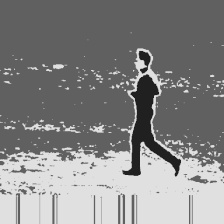
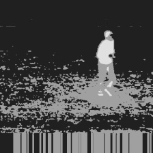
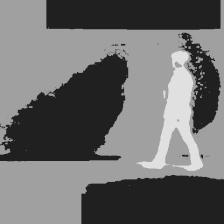

Testing was done on a newly established dataset, proving real life examples for fragmented occlusion. Some samples and 
the overlayed predicted heatmap are represented by the images below. The whole dataset can be downloaded under [this link](https://owncloud.tuwien.ac.at/index.php/s/V0GYNW6H7PtHhHS/download).
 
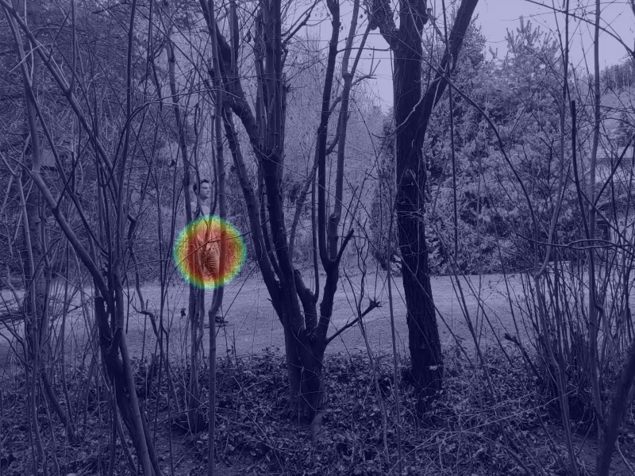
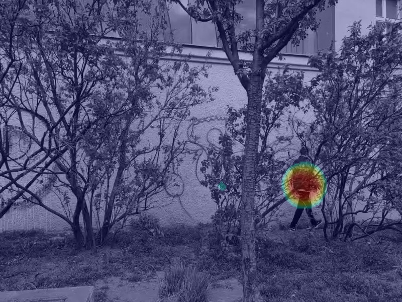
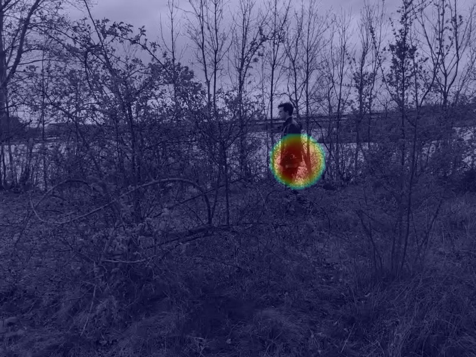
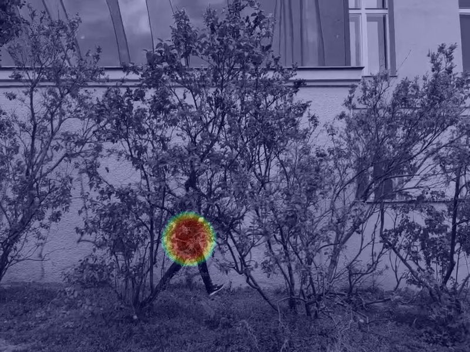
